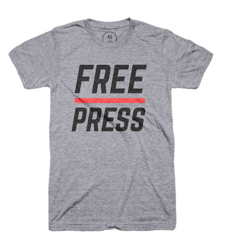
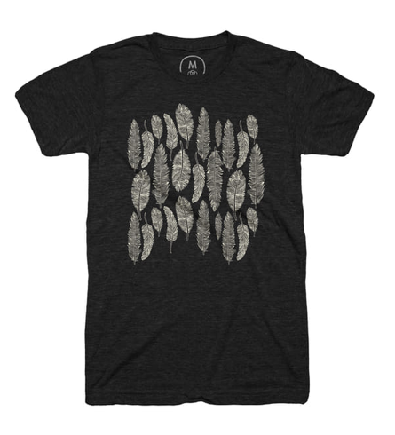

	

		<form class="form-horizontal is-flex" method="post" action="" id="billing_form">
			

				<h3 class="cart-title">1 Order Summary</h3>
				

					

						

							
						

						

							
<b>Product name</b>

							
Typography

							<ul class="list-inline">
								<li class="pro-size">
									

										<select class="form-control" name="">
											<option value="xs">Men - XS</option>
											<option value="s" selected>Men - S</option>
											<option value="m">Men - M</option>
											<option value="l">Men - L</option>
											<option value="xl">Men - XL</option>
										</select>
									

								</li>
								<li class="pro-quantity">
									

										Qty.
										<input type="text" class="form-control" placeholder="0" aria-describedby="quantity" value="1" />
									

								</li>
							</ul>
						

						

							
$5.0

						

						

							<a href=""></a>
						

					

					

						

							
						

						

							
<b>Product name</b>

							
Typography

							<ul class="list-inline">
								<li class="pro-size">
									

										<select class="form-control" name="">
											<option value="xs">Men - XS</option>
											<option value="s" selected>Men - S</option>
											<option value="m">Men - M</option>
											<option value="l">Men - L</option>
											<option value="xl">Men - XL</option>
										</select>
									

								</li>
								<li class="pro-quantity">
									

										Qty.
										<input type="text" class="form-control" placeholder="0" aria-describedby="quantity" value="1" />
									

								</li>
							</ul>
						

						

							
$5.0

						

						

							<a href=""></a>
						

					

					

						

							
						

						

							
<b>Product name</b>

							
Typography

							<ul class="list-inline">
								<li class="pro-size">
									

										<select class="form-control" name="">
											<option value="xs">Men - XS</option>
											<option value="s" selected>Men - S</option>
											<option value="m">Men - M</option>
											<option value="l">Men - L</option>
											<option value="xl">Men - XL</option>
										</select>
									

								</li>
								<li class="pro-quantity">
									

										Qty.
										<input type="text" class="form-control" placeholder="0" aria-describedby="quantity" value="1" />
									

								</li>
							</ul>
						

						

							
$5.0

						

						

							<a href=""></a>
						

					

					

						

							<strong>Subtotal</strong>
							
$20.0

						

						

							<small>Shipping</small>
							
-

						

					

					

						

							<strong>Order Total</strong>
							
<strong>$20.0</strong>

						

					

				
	
			
						
			

				<h3 class="cart-title">2 Shipping Address</h3>
				

					

						<label for="name">Full Name *</label>
						<input type="text" class="form-control" id="name" name="full_name" />
					

				

				

					

						<label for="phone">Phone Number *</label>
						<input type="tel" class="form-control" data-bv-phone="true" id="phone" name="phone" />
					

					

					

						<label for="email">Email address *</label>
						<input type="email" class="form-control" id="email" name="email" data-bv-emailaddress="true" />
					

				

				

					

						<label for="address">Address *</label>
						<input type="text" class="form-control" id="address" name="address" />
					

				

				

					

						<label for="country">Country *</label>
						<input type="text" class="form-control" id="country" name="country" />
					

				

				

					

						<label for="city">City *</label>
						<input type="text" class="form-control" id="city" name="city" />
					

					

					

						<label for="state">State *</label>
						<input type="text" class="form-control" id="state" name="state" />
					

					

						<label for="zipcode">Zip Code *</label>
						<input type="text" class="form-control" id="zipcode" name="zip" data-bv-digits="true" />
					

				

				

					<label data-toggle="collapse" data-target="#acc_pw" aria-expanded="false" aria-controls="acc_pw">
						<input type="checkbox" value="" checked />
						<i class="cr-icon glyphicon glyphicon-ok"></i>
						Create account using these information
					</label>
				

				

					

						

							<label for="pw">Password *</label>
							<input type="password" class="form-control" id="pw" name="pw" />
						

						

						

							<label for="cpw">Confirm Password *</label>
							<input type="password" class="form-control" id="cpw" name="cpw" />
						

					

				

				

					<label>
						<input type="checkbox" value="" checked />
						<i class="cr-icon glyphicon glyphicon-ok"></i>
						Subscribe our Newsletter
					</label>
				

			

			

				

					<h3 class="cart-title">3 Promotion code</h3>
					

						

							<label for="prommo">Promotion code</label>
							<input id="promo" name="promo_code" type="text" class="form-control" />
						

					

				

				

					<h3 class="cart-title">4 Payment Method</h3>
					

						

							
Please choose your payment method

							

								<label>
									<input type="radio" value="credit" name="payment-method" checked data-target="#credit">Credit Cards
									<i class="cr-icon r-circle"></i>
								</label>
							

							

								<label>
									<input type="radio" value="gateways" name="payment-method" data-target="#gateways">Payment Gateways
									<i class="cr-icon r-circle"></i>
								</label>
							

							

								<label>
									<input type="radio" value="later" name="payment-method" data-target="#later">Pay when package delivered
									<i class="cr-icon r-circle"></i>
								</label>
							

						

					

					

						

							

								

									<label for="CreditCardType">Card Type *</label>
									<select id="CreditCardType" name="CreditCardType" class="form-control">
										<option value="visa">Visa</option>
										<option value="master">MasterCard</option>
										<option value="amex">American Express</option>
										<option value="discover">Discover</option>
									</select>
								

							

							

								

									<label for="carNumber">Credit Card Number *</label>
									<input id="carNumber" name="card_number" type="text" class="form-control" 
									data-bv-creditcard="true"
									data-bv-creditcard-message="The credit card number is not valid" />
								

								

								

									<label for="ccv">Card CVV *</label>
									<input id="ccv" name="ccv" type="text" data-bv-cvv="true" class="form-control" />
								

							

							

								

									<label>Expiration Date *</label>
								

								

									<select class="form-control" name="month">
										<option value="">Month</option>
										<option value="01">January</option>
										<option value="02">Februarary</option>
										<option value="03">March</option>
										<option value="04">April</option>
										<option value="05">May</option>
										<option value="06">June</option>
										<option value="07">July</option>
										<option value="08">August</option>
										<option value="09">September</option>
										<option value="10">October</option>
										<option value="11">November</option>
										<option value="12">December</option>
									</select>
								

								

									<select class="form-control" name="year">
										<option value="">Year</option>
										<option value="2015">2015</option>
										<option value="2016">2016</option>
										<option value="2017">2017</option>
										<option value="2018">2018</option>
										<option value="2019">2019</option>
										<option value="2020">2020</option>
										<option value="2021">2021</option>
										<option value="2022">2022</option>
										<option value="2023">2023</option>
										<option value="2024">2024</option>
										<option value="2025">2025</option>
									</select>
								

							

							

								

									
Pay secure using your credit card.

								

								

									<ul class="cards list-inline">
										<li></li>
									</ul>
									

								

							

						

						

							

								

									

										<label>
											<input type="radio" name="payment-gateways" value="123pay">
											

										</label>
									

									

										<label>
											<input type="radio" name="payment-gateways" value="123pay">
											

										</label>
									

									

										<label>
											<input type="radio" name="payment-gateways" value="123pay">
											

										</label>
									

								

							

						

						

						

							

								<button type="submit" class="btn-lg ts-main-btn">$20.0 - Place Order</button>
								
<small>By click "Place holder", you agree with our <a href="term-condition.html">Term & Conditions</a></small>

							

						

					

				

			

		</form>
	

